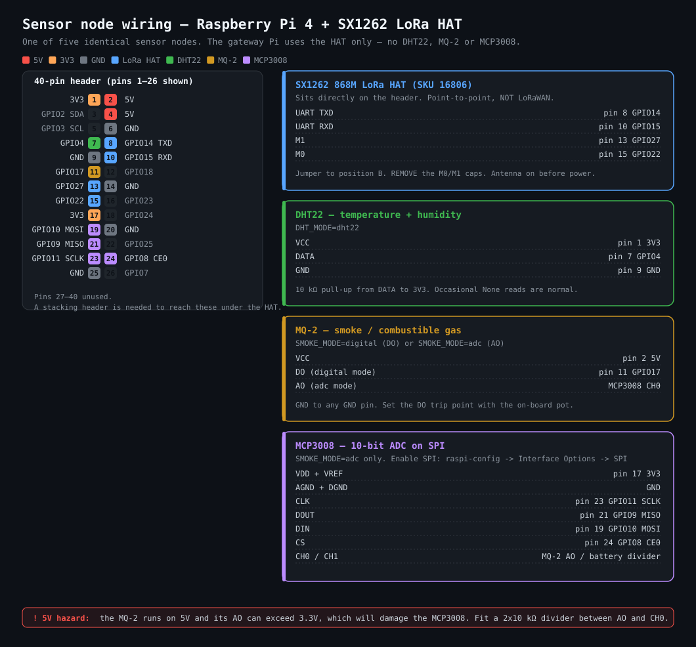

# Raspberry Pi Deployment Guide

Hardware: Raspberry Pi 4 × 6, Waveshare **SX1262 868M LoRa HAT** (SKU 16806) on each.

Six Pis: one gateway, two cluster heads, three plain sensor nodes.

```
   CLUSTER A                                 CLUSTER B
   ┌────────────┐  ┌────────────┐            ┌────────────┐
   │  node 2    │  │  node 3    │            │  node 5    │
   │  member    │  │  member +  │            │  member +  │
   │            │  │  backup CH │            │  backup CH │
   └─────┬──────┘  └─────┬──────┘            └─────┬──────┘
         │  slot 4       │  slot 5                 │  slot 7
         └───────┬───────┘                         ▼
                 ▼                          ┌─────────────┐
          ┌─────────────┐   slot 8          │  CH-B  (4)  │
          │  CH-A  (1)  │ ◄─────────────────│  cluster    │
          │  cluster    │                   │  head B     │
          │  head A     │                   └─────────────┘
          └──────┬──────┘                   out of gateway range
                 │ slot 9                   ON PURPOSE — this is
                 ▼                          what makes the relay real
        ┌──────────────────┐
        │  GATEWAY  (0)    │  gateway.py → SQLite
        │  beacon, slot 0  │  api.py     → dashboard :5000
        └──────────────────┘
```

Readings travel **node → cluster head → gateway**, and cluster B travels
**node 5 → CH-B → CH-A → gateway** — three hops. The origin node is carried in
every packet, so a relayed reading is still attributed to the Pi that sensed it.

Two properties are structural rather than best-effort, and both are verified by
`tools/netsim.py`:

- **No collisions.** Every transmission happens in a TDMA slot owned by exactly
  one radio. Not CSMA — carrier sense would fail here anyway, because node 2
  cannot hear CH-B and they are a textbook hidden-terminal pair.
- **No local minima.** Nothing does greedy geographic forwarding. Each node has
  an explicit ordered next-hop list in `config.ROUTES`; if the first hop does
  not acknowledge, it falls through to the next, and if none answer the reading
  is buffered rather than handed to a neighbour with no path onward.

## Two things to know before you start

**1. Your HAT is not LoRaWAN.** Waveshare states this explicitly: the SX1262 HAT
uses a private point-to-point protocol. TTN, ChirpStack, and every LoRaWAN
tutorial you'll find do not apply. The nodes address each other directly by
number, which is simpler and fine for a closed network like this one.

**2. The Pi has no analog input.** The MQ-2's AO pin outputs a voltage the Pi
physically cannot read. You have three options, and `SMOKE_MODE` in
`node/sensors.py` switches between them:

| Mode | Extra hardware | Smoke data quality |
|---|---|---|
| `simulate` | none | fake values — develop the software today |
| `digital` | none | on/off only, from the MQ-2's DO pin |
| `adc` | MCP3008 (~₹150) | real ppm curve — what you want for the report |

Start on `simulate`, prove the radio link works, then add the MCP3008.

## Frequency: use 866, not 868

The box says 868M, but that's the hardware band (850–930 MHz tunable), not a
fixed channel. India's licence-exempt allocation is **865–867 MHz**; 868 MHz is
the European band. `config.py` defaults to `FREQ = 866` for this reason. Every
Pi must use the same value or they won't hear each other.

---

## Fast path — `setup.sh`

Steps 2, 3, 5 and 8 below are automated. On each Pi, once the repo is cloned:

```bash
cd ~/forest-fire-dashboard/pi

sudo ./setup.sh gateway      # on the gateway Pi
sudo ./setup.sh node 1       # on sensor Pi 1 ... through node 5
```

It installs the Python packages for that role, downloads Waveshare's
`sx126x.py` and puts it where the code expects, enables UART (and SPI on
sensor nodes), disables the serial login console that would otherwise fight
the HAT for `/dev/ttyS0`, adds you to `dialout`, and installs and enables the
systemd units. Re-running it is safe — every step checks before acting.

You still have to do the physical work yourself: **Step 1** (jumpers) and
**Step 4** (sensor wiring). And edit `common/config.py` for real coordinates
and a non-default `CRYPT_KEY` (**Step 6**).

Reboot when it says to — the serial and SPI changes need it.

---

## Step 1 — HAT jumpers (all Pis)

- **UART selection jumper → position B** (LoRa module talks to the Pi)
- **Remove the M0 and M1 jumper caps.** The driver drives these from BCM22 and
  BCM27; leaving the caps on means the Pi can't switch the module between
  config and transmit mode.
- Screw on the SMA antenna **before powering up**. Transmitting without an
  antenna can damage the PA.

## Step 2 — Enable the serial port (all Pis)

```bash
sudo raspi-config
#   Interface Options → Serial Port
#   "login shell over serial?"  → No
#   "serial port hardware enabled?" → Yes
sudo reboot
```

Confirm which device you actually got:

```bash
ls -l /dev/serial*
```

If `serial0` points at something other than `ttyS0`, set it:
`export LORA_SERIAL=/dev/ttyAMA0`

## Step 3 — Waveshare driver (all Pis)

```bash
cd ~
wget https://files.waveshare.com/upload/1/18/SX126X_LoRa_HAT_CODE.zip
unzip SX126X_LoRa_HAT_CODE.zip
```

Copy `sx126x.py` next to the script that needs it:

```bash
cp SX126X_LoRa_HAT_Code/raspberrypi/python/sx126x.py ~/forest-fire-dashboard/pi/node/      # sensor Pis
cp SX126X_LoRa_HAT_Code/raspberrypi/python/sx126x.py ~/forest-fire-dashboard/pi/gateway/   # gateway Pi
```

It is not bundled here because it's Waveshare's code — pull it from source so
you get any fixes they publish.

## Step 4 — Sensor wiring (sensor Pis only)



Colour-coded pin map in [`docs/wiring.svg`](docs/wiring.svg) — open it directly
for a full-size version. The same information as the tables below, laid out by
device.

**DHT22** (temperature + humidity)

| DHT22 | Pi |
|---|---|
| VCC | 3.3 V (pin 1) |
| DATA | BCM 4 (pin 7) — 10 kΩ pull-up to 3.3 V |
| GND | GND (pin 9) |

**MQ-2 in `digital` mode**

| MQ-2 | Pi |
|---|---|
| VCC | 5 V (pin 2) |
| DO | BCM 17 (pin 11) |
| GND | GND |

Set the trip point with the pot on the MQ-2 board.

**MQ-2 in `adc` mode — MCP3008 on SPI**

| MCP3008 | Pi |
|---|---|
| VDD, VREF | 3.3 V |
| AGND, DGND | GND |
| CLK | BCM 11 / SCLK (pin 23) |
| DOUT | BCM 9 / MISO (pin 21) |
| DIN | BCM 10 / MOSI (pin 19) |
| CS | BCM 8 / CE0 (pin 24) |
| CH0 | MQ-2 AO |
| CH1 | battery divider midpoint (optional) |

Enable SPI: `sudo raspi-config` → Interface Options → SPI → Yes.

> The MQ-2 runs on 5 V and its AO can swing above 3.3 V, which would damage the
> MCP3008. Put a divider (two 10 kΩ resistors) between AO and CH0, or use a
> 3.3 V-tolerant MQ-2 breakout.

The LoRa HAT uses UART (BCM 14/15) plus BCM 22/27 — no conflict with SPI or
BCM 4/17, so everything coexists. You'll want a stacking header to reach the
GPIO pins under the HAT.

## Step 5 — Python packages

Gateway Pi:

```bash
pip3 install --break-system-packages flask flask-cors pyserial RPi.GPIO
```

Sensor Pis:

```bash
pip3 install --break-system-packages pyserial RPi.GPIO
# only if using real sensors:
sudo apt install -y libgpiod2
pip3 install --break-system-packages adafruit-circuitpython-dht adafruit-circuitpython-mcp3xxx
```

## Roles, slots and the frame

`config.py` is the single source of truth. Every Pi runs the same file; only
`NODE_ID` differs, and the role follows from it.

| addr | role | cluster | sends to | duty cycle |
|---|---|---|---|---|
| 0 | gateway | — | — | always on (mains) |
| 1 | **CH-A** | A | gateway | 30% |
| 2 | node | A | CH-A, else node 3 | 6.7% |
| 3 | node + backup CH-A | A | CH-A, else gateway | 10% |
| 4 | **CH-B** | B | CH-A, else gateway | 16.7% |
| 5 | node + backup CH-B | B | CH-B, else CH-A | 6.7% |

One 60-second superframe, ten 2-second slots, then every radio sleeps:

```
slot 0  gateway  beacon broadcast          heard by 1, 2, 3
slot 1  CH-A     rebroadcasts the beacon   heard by 4
slot 2  CH-B     rebroadcasts the beacon   heard by 5
slot 3  CH-A     own reading    → gateway
slot 4  node 2   reading        → CH-A
slot 5  node 3   reading        → CH-A
slot 6  CH-B     own reading    → CH-A
slot 7  node 5   reading        → CH-B
slot 8  CH-B     forwards cluster B  → CH-A
slot 9  CH-A     forwards everything → gateway
        ── 40 s of silence, radios off ──
```

Slots 1 and 2 exist because cluster B cannot hear the gateway, so it cannot
hear the sync beacon either. Sync is relayed along the same tree the data
takes. Each relay needs its **own** slot — two heads rebroadcasting in one slot
would collide with each other.

**Backup heads.** Node 3 covers CH-A, node 5 covers CH-B. Promotion triggers
after `HEAD_MISS_LIMIT` frames in which the head fails to acknowledge an
uplink — deliberately *not* on beacon silence, because a head can be alive and
simply have nothing to rebroadcast. A promoted backup **adopts the dead head's
slots**, which is why failover cannot cause a collision: the head it replaces
is by definition not transmitting.

`tdma.validate_schedule()` runs at every startup and refuses to boot on a slot
map where two radios could transmit at once. `setup.sh` runs it too, before
installing any service.

## Step 6 — Configure node identities

Edit `pi/common/config.py` on **every** Pi so the `NODES` dictionary matches
your real deployment — names and GPS coordinates. The gateway serves these to
the dashboard, so wrong coordinates mean pins in the wrong place on the map.

Also change `CRYPT_KEY` from the default. Without that, anyone with the same
HAT on 866 MHz can inject readings into your dashboard.

## Step 7 — Bring it up

**Gateway Pi**, two terminals:

```bash
cd ~/forest-fire-dashboard/pi/gateway
python3 gateway.py          # LoRa receiver → database
```

```bash
cd ~/forest-fire-dashboard/pi/gateway
python3 api.py              # HTTP API + dashboard on :5000
```

**Each sensor Pi:**

```bash
cd ~/forest-fire-dashboard/pi/node
NODE_ID=1 SMOKE_MODE=simulate DHT_MODE=simulate python3 sensor_node.py
```

Change `NODE_ID` per Pi. Once sensors are wired: `SMOKE_MODE=adc DHT_MODE=dht22`.

**Switch the dashboard to live data** — one line in `index.html`:

```html
<!-- <script src="data-source.js"></script> -->
<script src="data-source.live.js"></script>
```

Open `http://<gateway-pi-ip>:5000` from any device on the network.

## Step 8 — Run on boot

`setup.sh` already did this. The units live in [`systemd/`](systemd/):

| Unit | Pi | Runs |
|---|---|---|
| `fire-gateway.service` | gateway | `gateway.py` — radio → SQLite |
| `fire-api.service` | gateway | `api.py` — HTTP :5000 |
| `fire-node.service` | each sensor | `sensor_node.py` |

They ship with `@REPO_DIR@`, `@RUN_USER@` and `@NODE_ID@` placeholders that
`setup.sh` substitutes at install time, so nothing carries a hardcoded path.

```bash
systemctl status fire-gateway fire-api      # gateway
journalctl -u fire-node -f                  # sensor node, live
```

To move a node off simulated sensors, edit
`/etc/systemd/system/fire-node.service`, set `SMOKE_MODE=adc` and
`DHT_MODE=dht22`, then `sudo systemctl daemon-reload && sudo systemctl restart
fire-node`.

Installing by hand instead:

```bash
sed -e "s|@REPO_DIR@|$HOME/forest-fire-dashboard|g" \
    -e "s|@RUN_USER@|$USER|g" -e "s|@NODE_ID@|1|g" \
    systemd/fire-node.service | sudo tee /etc/systemd/system/fire-node.service
sudo systemctl daemon-reload && sudo systemctl enable --now fire-node
```

---

## Run the whole network on your laptop — `tools/netsim.py`

Before touching hardware, run the six-Pi network in one process. It imports the
**real** `gateway.py` and `sensor_node.py` and drives them against a virtual
radio, so what it tests is what ships.

```bash
python3 tools/netsim.py --frames 8            # normal operation
python3 tools/netsim.py --frames 6 --fire 5   # deepest node detects fire
python3 tools/netsim.py --frames 12 --kill 1  # CH-A dies, backup promotes
python3 tools/netsim.py --frames 8 --loss 0.15
```

Expected on a clean run:

```
transmissions : 184
collisions    : 0
rows stored   : 40          (5 nodes × 8 frames, no duplicates)
  node 1  via 1  hops=1
  node 2  via 1  hops=2
  node 5  via 1  hops=3     ← relayed CH-B → CH-A → gateway
collisions        : PASS (0)
all nodes reached : PASS
```

The medium models airtime, range and overlap, and records any two overlapping
transmissions that a common neighbour could hear as a collision. If you change
the slot map, run this before you deploy.

## Prove the radio first — `tools/linktest.py`

Before wiring a single sensor, get **two** Pis talking. Everything else depends
on this working, and it is far easier to debug with nothing else attached.

```bash
# gateway Pi
python3 tools/linktest.py rx

# sensor Pi
python3 tools/linktest.py tx --node-id 1 --count 100
```

Ctrl-C the receiver for a scored summary:

```
node       recv     lost delivered  crc_fail  rssi_mean
1            98        2     98.0%         0      -84.3
```

What to look for:

| Column | Healthy | Meaning |
|---|---|---|
| `delivered` | ≥ 99% at close range | packets that arrived, from sequence numbers |
| `crc_fail` | 0 | anything else is interference or a bad antenna |
| `rssi_mean` | better than −100 dBm | below −110 and you are at the edge of range |

`NOTHING RECEIVED` prints the four likely causes in the order worth checking.

This doubles as a site survey: walk the forest, run a 50-packet burst at each
candidate position, and keep the spots that deliver. Do that **before**
mounting anything permanently.

## Testing without leaving your desk

1. Run everything in `simulate` mode. If packets arrive, the radio link and
   database are proven and any later problem is a sensor problem.
2. `curl http://localhost:5000/api/health` — should show `totalReadings` climbing.
3. `curl http://localhost:5000/api/nodes` — should list every node with fresh timestamps.
4. To exercise the fire alert without an actual fire, temporarily lower the
   thresholds in `config.py` (e.g. `temp_high: 28`) and restart a node.

## Troubleshooting

| Symptom | Cause |
|---|---|
| `setting fail, setting again` on startup | Jumper not on B, or M0/M1 caps still fitted |
| No packets received | Mismatched `FREQ`, `AIR_SPEED`, `NET_ID` or `CRYPT_KEY` between Pis |
| Serial permission denied | `sudo usermod -aG dialout $USER`, then log out and back in |
| DHT22 returns None frequently | Normal for the part — the code retries and reuses the last value |
| Short range | Antenna near metal or at ground level; raise it and keep air speed at 2400 |
| Dashboard shows all nodes offline | `gateway.py` not running, or `OFFLINE_AFTER` shorter than your uplink interval |

## What's still simulated

Nothing on the transport side — the protocol, gateway, database and API are
real. Sensor values are simulated only while `SMOKE_MODE`/`DHT_MODE` say so.
The `Simulate fire event` button in the dashboard is disabled on live data;
`data-source.live.js` logs a note explaining why when you click it.
